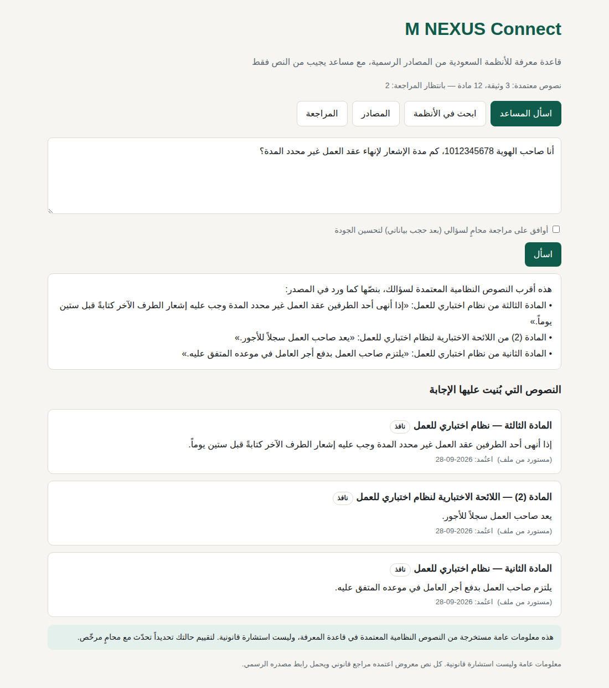
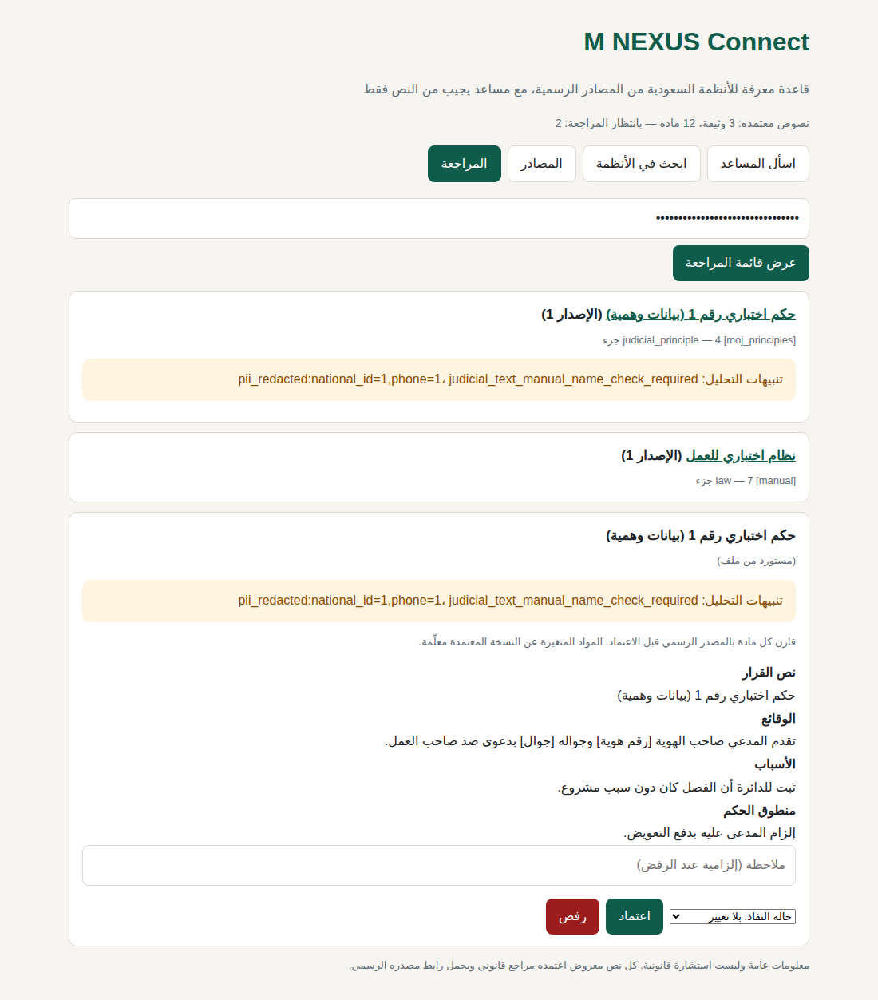

# M NEXUS Connect: المرحلة الأولى (قاعدة المعرفة والمساعد)

هذا الجزء من المستودع هو المرحلة الأولى من المنصة العامة الموصوفة في
[`../docs/PLATFORM_DESIGN.md`](../docs/PLATFORM_DESIGN.md). يتكوّن من أربعة أجزاء:

1. **خط استيراد:** يجلب الأنظمة والأحكام من المصادر الرسمية أو من ملفات، ويحفظ كل إصدار من كل وثيقة.
2. **مراجعة بشرية إلزامية:** لا يظهر أي نص للجمهور ولا يستخدمه المساعد قبل أن يعتمده مراجع قانوني.
3. **بحث عربي:** بحث في النصوص المعتمدة فقط، ويفهم رقم المادة بالكلمات أو بالأرقام.
4. **مساعد:** يجيب من النصوص المعتمدة فقط. يحجب البيانات الشخصية قبل أي معالجة، ويحذف من إجابته أي رقم
   مادة لا وجود له في النصوص المسترجعة، ويوجّه الحالات العاجلة إلى محامٍ.



---

## أولاً: ما لم يُستورد بعد، وسببه

**لم يُستورد أي نص نظامي حقيقي في هذا المستودع.** بيئة البناء تمنع الوصول إلى جميع المواقع الحكومية
السعودية: الطلبات إلى `laws.boe.gov.sa` و`laws.moj.gov.sa` و`uqn.gov.sa` و`ncar.gov.sa` و`moj.gov.sa`
و`sba.gov.sa` و`pp.gov.sa` و`moi.gov.sa` وغيرها رُفضت بالرمز 403 من سياسة الشبكة. جرّبتُ زحفاً حقيقياً على
بوابة هيئة الخبراء فرُفض أيضاً.

لهذا بُني الخط كاملاً واختُبر على **بيانات اختبار وهمية** محاكية، موجودة في `tests/fixtures` ومعلَّمة بوضوح
أنها وهمية. **الاستيراد الفعلي يُشغَّل على خادمكم** داخل المملكة، بالخطوات الواردة في "ثالثاً" أدناه.

كتابة نصوص الأنظمة من الذاكرة لملء القاعدة مرفوضة عمداً، لأن النص النظامي الذي لا يأتي من مصدره
الرسمي لا يصلح أساساً للمساعد ولا للمستخدم.

### ما يمكن استيراده من كل مصدر طلبته

| المصدر | الطريقة | ملاحظة |
|---|---|---|
| هيئة الخبراء (الأنظمة واللوائح والأوامر والمراسيم وقرارات مجلس الوزراء) | زحف آلي `boe` | المصدر المرجعي الأول |
| جريدة أم القرى | زحف آلي `uqn` يومياً | للتنبيه بصدور تعديلات جديدة |
| البوابة القانونية لوزارة العدل (التشريعات العدلية) | زحف آلي `moj_legislation` | يُرجَّح أنها تعمل بجافاسكربت، فالإعداد `render: browser` |
| الأحكام القضائية المنشورة (وزارة العدل) | زحف آلي `moj_judicial` | حجب آلي للهويات والجوالات، ثم فحص يدوي إلزامي للأسماء |
| مجموعات الأحكام والمبادئ القضائية بجميع إصداراتها | استيراد ملفات PDF `moj_principles` | تُنزَّل المجلدات ثم تُستورد |
| ديوان المظالم (الأحكام والمبادئ الإدارية) | استيراد ملفات `bog` | |
| النماذج العدلية والقضائية | استيراد ملفات `moj_forms` | كثير منها داخل ناجز بعد تسجيل الدخول |
| المركز الوطني للوثائق والمحفوظات | استيراد ملفات `ncar` | لم يثبت وجود بحث تشريعي عام فيه، والمنشور يحتاج طلباً رسمياً |
| النيابة العامة، الداخلية، المرور | زحف آلي أو استيراد ملفات | **المنشور فقط** |
| هيئة المحامين | زحف آلي `sba` | |
| الهيئات القطاعية (سدايا، الأمن السيبراني، السوق المالية، البنك المركزي، الزكاة والضريبة، التجارة، الموارد البشرية، المنافسة، الملكية الفكرية) | استيراد ملفات، ويمكن تحويلها لزحف بعد المعايرة | |
| مجلة الأحكام العدلية | استيراد ملفات `majalla` | **ليست نظاماً نافذاً في المملكة.** تُوسم "مرجع تاريخي"، ولا تظهر في البحث إلا عند طلبها صراحة، ويمنع النظام اعتمادها على أنها نافذة |
| مجلة الأحكام الشرعية (القاري، حنبلية) | استيراد ملفات `majalla_hanbali` | مرجع فقهي كذلك |
| التنظيمات والتعاميم الداخلية للجهات | **لا تُجمع** | غير منشورة. لا تُستورد إلا من الجهة نفسها وبتفويضها (`--authorized-by`) |

القائمة الكاملة بإعداداتها في [`sources/registry.yaml`](sources/registry.yaml)، وتُعرض بالأمر `nexus sources`.

---

## ثانياً: التشغيل

**المتطلبات:** Python 3.11 أو أحدث، وPostgreSQL 16. أو Docker.

```bash
cd platform
cp .env.example .env                        # املأ القيم
docker compose up -d db
docker compose run --rm ingest migrate      # ينشئ الجداول ويسجّل المصادر
docker compose up -d api                    # http://127.0.0.1:8000 (ضع أمامه وكيلاً عكسياً بشهادة TLS)
```

بدون Docker:

```bash
pip install -r requirements.txt
export NEXUS_DATABASE_URL=postgresql://...
python -m nexus_platform.cli migrate
uvicorn --factory nexus_platform.api.app:create_app --port 8000
```

---

## ثالثاً: الاستيراد الفعلي على خادمكم

### 1. قبل تشغيل أي زاحف

- راجِع شروط استخدام كل موقع، واطلب إذناً أو اتفاقية تبادل بيانات حيث يلزم (القسم 0.5 من وثيقة التصميم).
- ضع وسيلة تواصل حقيقية في `NEXUS_CRAWLER_CONTACT`، فالزاحف يعرّف نفسه بها للمواقع.
- الزاحف يلتزم تلقائياً بملف `robots.txt`. إذا تعذّرت قراءته أو أعاد 401 أو 403 أو خطأ خادم، يتوقف الزاحف
  ولا يفترض الإذن. ويفصل بين كل طلبين 3 ثوانٍ افتراضياً.

### 2. معايرة كل مصدر

جميع الزواحف **معطّلة** افتراضياً وغير معايَرة. أنماط الروابط مأخوذة من روابط حقيقية ظهرت في نتائج
البحث، لكن محددات المحتوى لم تُختبر على المواقع الحية لأنها محجوبة هنا.

```bash
python -m nexus_platform.cli calibrate "https://laws.boe.gov.sa/BoeLaws/Laws/LawDetails/<GUID>/1" --source boe
python -m nexus_platform.cli calibrate "https://laws.moj.gov.sa/ar/legislation/<ID>" --source moj_legislation --browser
```

يعرض الأمر عدداً من البيانات، وأهمها:
- العنوان المستخرج، وأداة الإصدار وتاريخها.
- عدد رؤوس المواد المكتشفة، والتنبيهات.
- روابط الوثائق والروابط التي سيتبعها الزاحف.

إذا ظهر `no_articles_detected` أو كانت الروابط فارغة، فعدّل `selectors` و`follow_patterns` و`document_patterns`
للمصدر في `registry.yaml`. بعد أن تطمئن للنتيجة، ضع للمصدر `calibrated: true` و`enabled: true`.

المصادر المضبوطة على `render: browser` تحتاج Playwright:

```bash
pip install playwright && playwright install chromium
```

### 3. الاستيراد

```bash
python -m nexus_platform.cli crawl boe --max-pages 50           # تجربة صغيرة أولاً
python -m nexus_platform.cli crawl boe                          # ثم الزحف الكامل
python -m nexus_platform.cli import-files moj_principles /data/incoming/مجموعة-الأحكام-1440/
python -m nexus_platform.cli import-files majalla /data/incoming/majalla.txt
python -m nexus_platform.cli import-files internal_regulations /data/x.pdf --authorized-by "اسم الجهة ورقم خطاب التفويض"
```

**جدولة التحديث:** تُشغَّل الزواحف دورياً بـ cron، وجدولها المقترح في `registry.yaml`: أم القرى يومياً،
وهيئة الخبراء ووزارة العدل أسبوعياً.
- إذا لم يتغير نص وثيقة، لا يُنشأ لها شيء.
- إذا تغيّر، يُنشأ **إصدار جديد بانتظار المراجعة**.
- يبقى الإصدار المعتمد السابق هو المعروض حتى يُعتمد الجديد.
- الإصدارات القديمة لا تُحذف أبداً.

**استيراد الملفات يتعرّف على الوثيقة من اسم الملف.** لتحديث وثيقة مستوردة من ملف، أعد استيراد ملف بالاسم
نفسه. أو استخدم صيغة JSON وضع فيها معرّفاً ثابتاً في الحقل `id`.

### صيغة JSON (لاتفاقيات تبادل البيانات)

إذا وفّرت جهة رسمية بياناتها منظَّمة، فهذه الصيغة تُستورد مباشرة دون أي تحليل للنص:

```json
{"documents": [{"id": "معرّف ثابت", "title": "...", "doc_type": "law", "legal_status": "in_force",
  "instrument": "كما ورد", "url": "رابط المصدر", "preamble": "...",
  "articles": [{"label": "المادة الأولى", "text": "..."}]}]}
```

### 4. المراجعة (إلزامية)

من الواجهة: تبويب "المراجعة" برمز المراجع. أو من سطر الأوامر:

```bash
python -m nexus_platform.cli pending
python -m nexus_platform.cli review 42 approve --reviewer "اسم المراجع" --legal-status in_force
python -m nexus_platform.cli review 43 reject --reviewer "اسم المراجع" --note "المادة 12 مبتورة في المصدر"
```



**ما تعرضه شاشة المراجعة:**
- تنبيهات التحليل: فجوة في الترقيم، أو مادة مكررة، أو PDF نصه معكوس، أو معرّفات حُجبت من حكم قضائي.
- المواد التي تغيّرت عن الإصدار المعتمد السابق، معروضة جنباً إلى جنب.

**قواعد المراجعة:**
- الرفض يتطلب ملاحظة.
- كل قرار يُسجَّل في سجل تدقيق للإضافة فقط، وقاعدة البيانات نفسها ترفض أي تعديل عليه أو حذف منه.

---

## رابعاً: المساعد

| الإعداد | السلوك |
|---|---|
| `NEXUS_LLM_PROVIDER=extractive` (الافتراضي) | لا نموذج لغوي. يعرض أقرب النصوص المعتمدة بنصّها الحرفي. لا يمكن أن يختلق شيئاً، ولا تخرج أي بيانات من الخادم |
| `NEXUS_LLM_PROVIDER=claude` | يصوغ شرحاً مبسطاً من النصوص المسترجعة عبر Claude (`claude-opus-5-5`)، مع التفعيل التلقائي لنموذج بديل عند الرفض (`fallbacks: "default"`) |

**لا تفعّل `claude` قبل** تقييم نقل البيانات خارج المملكة وفق نظام حماية البيانات الشخصية ولائحة النقل
(القسم 0.6 من وثيقة التصميم). حتى بعد تفعيله تبقى هذه الضمانات:

- **لا يخرج نص السؤال إلا بعد الحجب:** الهوية والجوال والهاتف والبريد والآيبان تُحجب قبل أي إرسال.
  **الأسماء لا يمكن حجبها آلياً بموثوقية،** ولهذا السبب تحديداً وُضعت الضمانة التالية.
- **المجالات الحساسة لا تغادر الخادم إطلاقاً:** الجنائي والأحوال الشخصية والصحي (`NEXUS_LOCAL_ONLY_CATEGORIES`)
  تُجاب بالعرض الحرفي للنصوص دائماً.
- **تحقق من كل رقم مادة:** كل رقم مادة في الإجابة يُطابَق مع النصوص المسترجعة. الجملة التي تحوي رقماً غير
  موجود، أو رقم قضية، أو عبارة من نوع "قضيتك رابحة"، تُحذف. إذا حُذف كل شيء، تُعرض النصوص حرفياً.
- **لا يتوقف المساعد عند تعطل النموذج:** عند فشله أو رفضه يعود المساعد تلقائياً إلى العرض الحرفي.
- **التوجيه العاجل يعمل دون أي نموذج:** كشف الحالات العاجلة (توقيف، مهلة قريبة، عنف، إيذاء النفس) يتم
  محلياً قبل أي معالجة.
- **السجل:** يُحفظ السؤال محجوباً فقط. ولا تُراجع المحادثة بشرياً إلا بموافقة صريحة من المستخدم.

---

## خامساً: الاختبارات

```bash
pip install -r requirements-dev.txt
NEXUS_TEST_ADMIN_URL=postgresql://postgres@127.0.0.1:5432/postgres pytest
```

تنشئ الاختبارات قاعدة بيانات مؤقتة وتحذفها في النهاية. عددها 25، وتغطي:
- **النص العربي:** تحويل أرقام المواد المكتوبة بالكلمات، ومنها "الحادية والعشرون بعد المائة" و"الثانية
  بعد المائتين" و"مكرر".
- **الزحف:** على خادم محلي، مع التحقق من الالتزام بـ robots.txt، وعدم الخروج عن أنماط الروابط، وتجاهل
  محتوى السكربتات.
- **الإصدارات والمراجعة:** أن النص غير المعتمد لا يظهر في البحث، وأن التعديل يُنشئ إصداراً جديداً مع بقاء
  المعتمد، وأن التاريخ محفوظ.
- **الحماية:** منع اعتماد مرجع تاريخي على أنه نافذ، وإلزامية التفويض للمحتوى غير المنشور، وأن سجل التدقيق
  للإضافة فقط.
- **المساعد:** حذف رقم مادة مختلق، والعودة للعرض الحرفي عند التعطل، وأن النموذج والسجل لا يصلهما إلا
  السؤال المحجوب، وأن المجالات الحساسة تبقى على الخادم، وشكل طلب Claude.
- **الواجهة البرمجية:** كاملة، بما فيها رفض الوصول للمراجعة دون رمز صحيح، وترويسات الأمان.

**لم يُختبر في بيئة البناء:**
- **صورة Docker:** لا يوجد خادم Docker في بيئة البناء.
- **الاتصال الفعلي بـ Claude:** لا يوجد مفتاح API، فاختُبر شكل الطلب بعميل وهمي.
- **الزحف على المواقع الحكومية الحقيقية:** محجوبة كما سبق.

**لم يُبنَ بعد في هذه المرحلة:**
- **البحث الدلالي بالمتجهات (pgvector):** البحث الحالي نصي عربي مع مطابقة أرقام المواد وتشابه العناوين. لم
  يُضف البحث الدلالي لأن تنزيل نموذج التضمين العربي محجوب في بيئة البناء. يُضاف في الخادم عمود `embedding`
  ومرحلة تضمين بعد الاعتماد، دون تغيير بقية الخط.
- **حسابات الجمهور وسوق المحامين:** من المرحلة الثانية.
